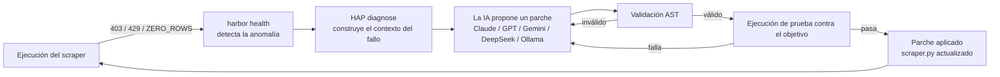
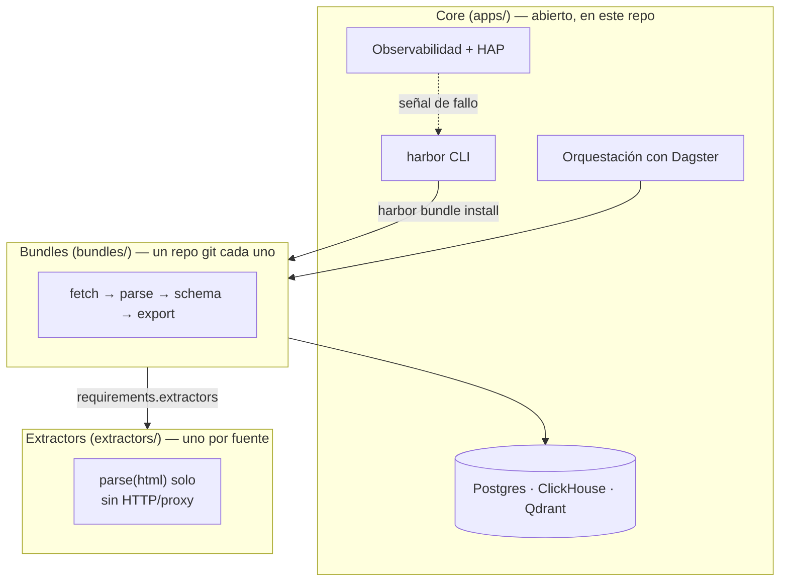

# 🌊 DataHarbor — scrapers web que se autorreparan

[](https://github.com/eugene-panin/DataHarbor/actions/workflows/ci.yml)
[](LICENSE)

> **Idiomas / Languages:** [🇬🇧 English](README.md) · [🇷🇺 Русский](README.ru.md) · [🇺🇦 Українська](README.uk.md) · **🇪🇸 Español** · [🇹🇷 Türkçe](README.tr.md)

> **21-09-2026:** una auditoría externa tras el primer lanzamiento público
> encontró 22 problemas más 4 observaciones adicionales, en self-healing,
> la capa de datos, el despliegue CLI/Kubernetes y seguridad (path
> traversal, un paso de publish que seguía symlinks, un paso de backup que
> podía mentir sobre su éxito). Todo está corregido y verificado — varios
> mediante reproducción en vivo contra un stack real en ejecución o un
> clúster `kind` desechable, no solo revisión de código. Lista completa
> con causas raíz y verificación: **[CHANGELOG.md](CHANGELOG.md)**.

Todo scraper acaba rompiéndose: un sitio rediseña su markup, un selector deja
de coincidir y un pipeline empieza a devolver cero filas en silencio.
Normalmente eso significa que alguien nota el hueco en un dashboard días
después y termina editando el parser a mano. **Los scrapers de DataHarbor
diagnostican sus propios fallos y se reparan solos** — un agente de IA lee la
señal de fallo, propone una corrección de código, la valida (AST + una
ejecución de prueba real contra el objetivo) y la aplica. Tú revisas el diff
como cualquier otro commit.

Ese ciclo es el **Harbor Agent Protocol (HAP)**, y es la razón de ser de este
proyecto. Todo lo demás — ClickHouse, Postgres, Qdrant, Dagster,
observabilidad — es la plataforma con todas las pilas incluidas que la
autorreparación necesita para funcionar de verdad en producción, no solo en
una demo.



## Por qué existe esto

- **Autorreparación, no solo alertas.** `harbor health --auto-fix <bundle>`
  cierra el ciclo de punta a punta: detectar → diagnosticar → parchear →
  validar → desplegar. Agnóstico al modelo (Claude, GPT, Gemini, DeepSeek, o
  un modelo local de Ollama) — trae tu propia clave, o ninguna.
- **Stack de datos con todas las pilas incluidas.** PostgreSQL (`pgvector`),
  ClickHouse OLAP, búsqueda vectorial con Qdrant, orquestación con Dagster y
  observabilidad con Grafana, todo conectado y funcionando con un solo
  `harbor up`, para que un pipeline tenga dónde aterrizar datos de verdad
  desde el primer día.
- **Pensado para agentes de codificación con IA, no solo para humanos.**
  [AGENTS.md](AGENTS.md) es un único contrato agnóstico al agente
  (enrutamiento de skills, arquitectura, reglas de verificación) que Claude
  Code, Codex, Gemini CLI y Antigravity leen de la misma forma — ver
  [§ Agentes de IA y HAP](#-agentes-de-ia-y-el-harbor-agent-protocol).

**Qué es abierto y qué es privado:** la plataforma (`apps/`), la CLI y un
bundle `demo` de extremo a extremo son open-core y viven en este repo. Los
objetivos reales de scraping — los bundles concretos y los extractors
específicos de cada sitio — son privados por diseño (ver
[Arquitectura](#-arquitectura-core--bundles--extractors) más abajo) y se
instalan desde tus propios repos git con `harbor bundle install`. Clonar
este repo te da una plataforma funcional y un ejemplo funcional, no una
biblioteca de scrapers listos para usar.

---

## 🏛 Arquitectura: Core / Bundles / Extractors



* **Core (`apps/`)** — runtime de la plataforma abierta: PostgreSQL
  `pgvector`, ClickHouse OLAP, Qdrant, SeaweedFS S3, Dagster, notificador
  Core (Telegram/Slack/webhooks). Opcional: `uv sync --extra ml`, n8n
  mediante `--with-n8n`. La CLI de backup se queda en Core (`harbor backup`).
* **Bundles (`bundles/`)** — pipelines de negocio (fetch → schema → Dagster
  → export HTML/CSV). Un bundle = un repositorio git al publicarlo.
* **Extractors (`extractors/`)** — plugins de parseo de una sola fuente
  (solo `parse(html, …)`; sin HTTP/proxy). Reutilizables por varios
  bundles. El open-core incluye el ejemplo `demo_site`; los extractors de
  dominio se instalan desde git.

Un bundle declara sus dependencias en `manifest.json` →
`requirements.extractors` (id local, URL git o `{name, source}`). Con
`harbor bundle install`, la plataforma descarga los extractors declarados en
`extractors/`.

---

## ⚡ Inicio rápido

### 1. Instalación
```bash
git clone https://github.com/eugene-panin/DataHarbor.git
cd DataHarbor
./install.sh   # requiere uv; instala las dependencias con `uv sync` y enlaza `harbor`
```

```bash
uv sync
uv sync --extra ml   # opcional: Whisper / EasyOCR / embeddings / HDBSCAN
uv run harbor --help
uv run harbor doctor   # incluye Publish readiness (identidad git; gh opcional)
```

### 2. Arrancar la plataforma
```bash
harbor up
```
*Inicia los servicios de la plataforma en Kubernetes (Tilt) o Docker Compose
(`harbor up --compose`).*

### 3. Comprobar estado
```bash
harbor status
```

### 4. Probar el bundle de demo (sin claves de API, sin red externa)

El open-core incluye un ejemplo funcional de extremo a extremo: un fixture
estático `demo_site` (`deploy/demo_site/`) scrapeado hacia PostgreSQL por el
bundle `demo` (`bundles/demo/`).

```bash
harbor bundle run demo    # scrapea el fixture local y escribe en PostgreSQL
harbor bundle view demo   # genera un informe HTML de las filas scrapeadas
```

`harbor bundle run` delega en `dagster asset materialize`; puedes hacer lo
mismo a mano desde la Dagster UI (materializando el grupo de assets `demo`).
Usa los archivos de este bundle (`fetch.py` / `scraper.py` / `db.py` /
`assets.py` / `exporter.py`) como punto de partida para el tuyo.

### 5. Verlo repararse solo

Rompe la demo a propósito y deja que HAP la repare:

```bash
# Simula un drift: renombra el selector que busca el extractor de demo_site
sed -i.bak 's/h1, h2, h3/h1, h3/' extractors/demo_site/extractor.py
harbor bundle run demo                               # ahora devuelve 0 filas — una anomalía ZERO_ROWS real
harbor health                                         # marca demo como DEGRADED
harbor health --auto-fix demo --url http://demo_site/   # diagnostica, parchea, valida AST, verifica en vivo
harbor bundle run demo                                # las filas vuelven
```

`--url` cierra el ciclo de verdad: tras la validación AST, el parche se
aplica y **se verifica con un scrape en vivo contra esa URL**. Si sigue
devolviendo cero filas, el fallo se envía de vuelta al modelo para un
segundo intento; si ese también falla, `scraper.py` se revierte a la
versión previa al parche en lugar de quedar en un estado que "parece
parcheado" pero no funciona. Sin `--url` el parche solo pasa una
comprobación de importación — suficiente para detectar una referencia
rota, no para demostrar que el scrape funciona.

Necesita una clave de LLM en `.env` — `AI_REPAIR_PROVIDER` /
`AI_REPAIR_API_KEY`, o `AI_REPAIR_PROVIDER=ollama` para un modelo local.
¿No tienes ninguna clave configurada? `harbor health --fix demo` imprime el
prompt de diagnóstico en su lugar, para que veas exactamente de qué
partiría el agente.

---

## 📦 Publish: bundles y extractors

Modelo: **1 plugin = 1 repo git**. El staging usa un directorio temporal (o
`--workdir`); nunca se crea un `.git` anidado dentro del monorepo.

```bash
# Nuevo extractor / bundle
harbor extractor new demo_site
harbor bundle new my_leads --extractors demo_site

# Publica primero un extractor personalizado
harbor extractor publish demo_site --dry-run
harbor extractor publish demo_site
# → añádelo al manifest del bundle: git@github.com:<you>/dh-extractor-demo-site.git

# Luego publica el bundle
harbor bundle publish my_leads --dry-run
harbor bundle publish my_leads
# o explícitamente: --remote git@github.com:ORG/dh-bundle-my_leads.git
```

**Importante:** `harbor bundle publish` **no** crea automáticamente repos de
extractors en GitHub. Si `requirements.extractors` todavía lista ids/rutas
locales (no URLs git), la CLI los muestra y sugiere
`harbor extractor publish <id>`. Un publish real se detiene; `--dry-run`
solo avisa. Vía de escape: `--allow-local-extractors`. El ejemplo `demo_site`
incluido se omite.

Flags: `--remote`, `--workdir`, `--repo-name`, `--visibility private|public`,
`--public`, `--dry-run`. Necesita `git` más `user.name` / `user.email`; `gh`
es opcional (crea automáticamente un repo privado en GitHub).

---

## 🌐 Servicios web locales y puertos

| Servicio | Descripción | URL local |
| :--- | :--- | :--- |
| ☸️ **Tilt** | Panel de control de Kubernetes local | [http://localhost:10350](http://localhost:10350) |
| ⚡ **Dagster UI** | Orquestador ETL y panel de autorreparación | [http://localhost:3000](http://localhost:3000) |
| 🚀 **ClickHouse** | Almacén OLAP para analítica | [http://localhost:8123](http://localhost:8123) |
| 🧭 **Qdrant** | Búsqueda vectorial / RAG | [http://localhost:6333/dashboard](http://localhost:6333/dashboard) |
| 📊 **Grafana** | Paneles de observabilidad | [http://localhost:3001](http://localhost:3001) |
| 🔄 **n8n** (opcional) | Hub de automatización no-code | [http://localhost:56780](http://localhost:56780) (`harbor up --with-n8n`) |
| 🧪 **demo_site** | Fixture estático scrapeado por el bundle `demo` | [http://localhost:8098](http://localhost:8098) |

---

## 🛠 CLI (`harbor`)

### 1. Diagnóstico y control del entorno
```bash
harbor doctor             # Docker, Tilt, Kind, Python, Git + Publish readiness
harbor health             # Salud de scrapers, anomalías de filas cero, SLA
harbor health --auto-fix <bnd> --url <url> # Remediador con IA: validación AST + verificación en vivo + rollback
harbor up                 # Kubernetes/Tilt (o --compose)
harbor down
harbor status
harbor uninstall          # Elimina con backup automático en ~/DataHarbor_Backups
```

### 2. Backup maestro y restauración
```bash
harbor backup create
harbor backup restore <file.tar.gz>
harbor backup list
```

### 3. Harbor Agent Protocol (HAP v1.0)
```bash
harbor agent-protocol status
harbor agent-protocol diagnose <bnd>
harbor agent-protocol patch <bnd> --code-file <file>
harbor agent-protocol test <bnd>
```

### 4. Bundles
```bash
harbor bundle list
harbor bundle new <name> [--template default|ml|etl|dagster]
harbor bundle templates
harbor bundle install <src>   # Git / archivo / carpeta; descarga los extractors declarados
harbor bundle resolve <name>  # Instala los extractors que falten según el manifest
harbor bundle pack <name>
harbor bundle publish <name> [--dry-run] [--remote URL] [--allow-local-extractors]
harbor bundle remove <name>
harbor bundle run <name>      # materializa todos los assets de Dagster de forma síncrona (sin necesitar la UI)
harbor bundle export / view
harbor bundle validate
harbor bundle doctor [name]   # engines, deps de python, extractors, defs de Dagster
harbor workspace refresh      # regenera el workspace.yaml multi code-location
harbor workspace show
```

### 5. Extractors
```bash
harbor extractor list
harbor extractor new <name> [--path DIR]
harbor extractor install <src>
harbor extractor pack <name>
harbor extractor publish <name> [--dry-run] [--remote URL]
harbor extractor resolve <bundle>
harbor extractor validate [name]
harbor extractor remove <name>
```

---

## 🤖 Agentes de IA y el Harbor Agent Protocol

[AGENTS.md](AGENTS.md) es el único contrato agnóstico al agente para este
repo — arquitectura, el esquema del manifest de bundle/extractor y el flujo
diagnose → patch → validate → test de HAP v1.0. `CLAUDE.md` y `GEMINI.md`
son punteros mínimos hacia él, de modo que **Claude Code**, **Codex**,
**Gemini CLI** y **Antigravity** leen todos la misma fuente de verdad en
lugar de divergir.

Tres skills con alcance acotado enrutan el trabajo según la intención, en
lugar de un único prompt que lo haga todo:

| Skill | Función |
| :--- | :--- |
| [`dataharbor-bundle-designer`](.agents/skills/dataharbor-bundle-designer/SKILL.md) | Escribir o generar el andamiaje de un nuevo bundle/extractor |
| [`dataharbor-bundle-operator`](.agents/skills/dataharbor-bundle-operator/SKILL.md) | Comprobar salud/SLA, ejecutar `harbor agent-protocol summary` |
| [`dataharbor-remediator`](.agents/skills/dataharbor-remediator/SKILL.md) | Diagnosticar y reparar un scraper roto (HAP) |

`harbor skill install` las copia en `~/.claude/skills` (y la ruta
equivalente para Codex/Gemini/Antigravity), de modo que cualquiera de esas
herramientas las detecta automáticamente.

---

## 🤝 Contribuir

Las contribuciones a la plataforma open-core son bienvenidas — consulta
**[CONTRIBUTING.md](CONTRIBUTING.md)** para la configuración del entorno de
desarrollo, las comprobaciones de test/lint que ejecuta CI, y las pautas
para PRs. Lee también el **[Código de Conducta](CODE_OF_CONDUCT.md)**.

¿Encontraste un problema de seguridad? Repórtalo en privado — consulta
**[SECURITY.md](SECURITY.md)**, no abras un issue público.

---

## 📄 Licencia

MIT License © DataHarbor Core Team
