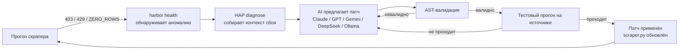
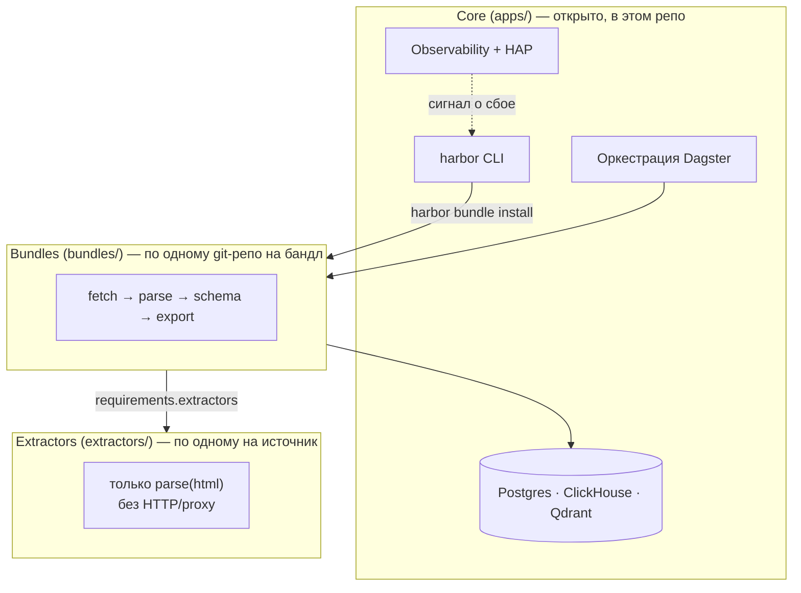

# 🌊 DataHarbor — скраперы, которые чинят себя сами

[](https://github.com/eugene-panin/DataHarbor/actions/workflows/ci.yml)
[](LICENSE)

> **Languages:** [🇬🇧 English](README.md) · 🇷🇺 Русский · [🇺🇦 Українська](README.uk.md) · [🇪🇸 Español](README.es.md) · [🇹🇷 Türkçe](README.tr.md)

Рано или поздно любой скрапер ломается: сайт меняет разметку, селектор
перестаёт находить элемент, и пайплайн незаметно начинает возвращать ноль
строк. Обычно это заканчивается тем, что человек через пару дней замечает
дыру в дашборде и вручную правит парсер. **Скраперы DataHarbor сами
диагностируют свои сбои и сами себя чинят** — AI-агент читает сигнал об
ошибке, предлагает патч кода, проверяет его (AST + реальный тестовый прогон
на целевом источнике) и применяет. Вам остаётся только посмотреть diff, как
в любом обычном коммите.

Этот цикл называется **Harbor Agent Protocol (HAP)**, и именно ради него
существует проект. Всё остальное — ClickHouse, Postgres, Qdrant, Dagster,
observability — это платформа с батарейками внутри, которая нужна
самоисцелению, чтобы реально работать в продакшене, а не только в демо.



## Зачем это нужно

- **Самоисцеление, а не просто алерты.** `harbor health --auto-fix <bundle>`
  замыкает весь цикл: detect → diagnose → patch → validate → deploy.
  Модель-агностично (Claude, GPT, Gemini, DeepSeek или локальная модель через
  Ollama) — приносите свой ключ или обходитесь вовсе без него.
- **Дата-стек с батарейками внутри.** PostgreSQL (`pgvector`), ClickHouse
  OLAP, векторный поиск Qdrant, оркестрация Dagster и observability на
  Grafana — всё связано вместе и поднимается одной командой `harbor up`, так
  что пайплайну есть куда реально складывать данные с первого дня.
- **Сделано для AI coding-агентов, а не только для людей.** [AGENTS.md](AGENTS.md) —
  единый агент-агностичный контракт (роутинг скиллов, архитектура, правила
  верификации), который одинаково читают Claude Code, Codex, Gemini CLI и
  Antigravity — см. [§ AI-агенты и HAP](#-ai-агенты-и-harbor-agent-protocol).

**Что открыто, а что приватно:** платформа (`apps/`), CLI и один сквозной
`demo`-бандл открыты и лежат в этом репозитории. Реальные цели скрапинга —
собственно бандлы и экстракторы под конкретные сайты — приватны по дизайну
(см. [Архитектуру](#-архитектура-core--bundles--extractors) ниже) и
устанавливаются из ваших собственных git-репозиториев командой
`harbor bundle install`. Клонирование этого репозитория даёт рабочую
платформу и рабочий пример, а не библиотеку готовых скраперов.

---

## 🏛 Архитектура: Core / Bundles / Extractors



* **Core (`apps/`)** — открытое ядро платформы: PostgreSQL `pgvector`,
  ClickHouse OLAP, Qdrant, SeaweedFS S3, Dagster, Core-нотификатор
  (Telegram/Slack/webhooks). Опционально: `uv sync --extra ml`, n8n через
  `--with-n8n`. Backup CLI остаётся в Core (`harbor backup`).
* **Bundles (`bundles/`)** — бизнес-пайплайны (fetch → schema → Dagster →
  HTML/CSV export). Один бандл = один git-репозиторий при публикации.
* **Extractors (`extractors/`)** — плагины парсинга одного источника (только
  `parse(html, …)`, без HTTP/proxy). Переиспользуются несколькими бандлами.
  В open-core поставляется пример `demo_site`; доменные экстракторы ставятся
  из git.

Бандл объявляет зависимости в `manifest.json` → `requirements.extractors`
(локальный id, git URL или `{name, source}`). При `harbor bundle install`
платформа сама подтягивает объявленные источники экстракторов в
`extractors/`.

---

## ⚡ Быстрый старт

### 1. Установка
```bash
git clone https://github.com/eugene-panin/DataHarbor.git
cd DataHarbor
./install.sh   # требует uv; ставит зависимости через `uv sync` и линкует `harbor`
```

```bash
uv sync
uv sync --extra ml   # опционально: Whisper / EasyOCR / embeddings / HDBSCAN
uv run harbor --help
uv run harbor doctor   # включая Publish readiness (git identity; gh опционален)
```

### 2. Запуск платформы
```bash
harbor up
```
*Поднимает платформенные сервисы в Kubernetes (Tilt) или Docker Compose
(`harbor up --compose`).*

### 3. Проверка статуса
```bash
harbor status
```

### 4. Попробуйте демо-бандл (без API-ключей, без внешней сети)

Open-core поставляется с рабочим сквозным примером: статичная фикстура
`demo_site` (`deploy/demo_site/`), которую скрапит в PostgreSQL бандл `demo`
(`bundles/demo/`).

```bash
harbor bundle run demo    # скрапит локальную фикстуру, пишет в PostgreSQL
harbor bundle view demo   # рендерит HTML-отчёт по собранным строкам
```

`harbor bundle run` под капотом вызывает `dagster asset materialize`; то же
самое можно сделать вручную в Dagster UI (материализовать группу ассетов
`demo`). Используйте файлы этого бандла (`fetch.py` / `scraper.py` /
`db.py` / `assets.py` / `exporter.py`) как отправную точку для своих.

### 5. Посмотрите, как он лечит себя сам

Сломайте демо нарочно, а потом дайте HAP его починить:

```bash
# Имитируем дрейф разметки: переименуем селектор, который ищет demo_site-экстрактор
sed -i.bak 's/h1, h2, h3/h1, h3/' extractors/demo_site/extractor.py
harbor bundle run demo           # теперь возвращает 0 строк — настоящая аномалия ZERO_ROWS
harbor health                    # помечает demo как DEGRADED
harbor health --auto-fix demo    # AI диагностирует, патчит, валидирует AST, перепроверяет
harbor bundle run demo           # строки снова на месте
```

(Нужен ключ LLM в `.env` — `AI_REPAIR_PROVIDER` / `AI_REPAIR_API_KEY`, либо
`AI_REPAIR_PROVIDER=ollama` для локальной модели. Нет ключа? `harbor
health --fix demo` вместо этого выведет диагностический промпт, чтобы вы
увидели, от чего именно отталкивался бы агент.)

---

## 📦 Publish: бандлы и экстракторы

Модель: **1 плагин = 1 git-репо**. Staging во временную папку (или
`--workdir`); внутри monorepo nested `.git` никогда не создаётся.

```bash
# Новый extractor / bundle
harbor extractor new demo_site
harbor bundle new my_leads --extractors demo_site

# Сначала публикуем кастомный extractor
harbor extractor publish demo_site --dry-run
harbor extractor publish demo_site
# → в manifest бандла: git@github.com:<you>/dh-extractor-demo-site.git

# Затем публикуем бандл
harbor bundle publish my_leads --dry-run
harbor bundle publish my_leads
# или явно: --remote git@github.com:ORG/dh-bundle-my_leads.git
```

**Важно:** `harbor bundle publish` **не** создаёт extractor-репозитории на
GitHub автоматически. Если в `requirements.extractors` всё ещё числятся
локальные id/пути (не git URL), CLI выведет их список и предложит
`harbor extractor publish <id>`. Реальный publish остановится; `--dry-run`
только предупредит. Escape hatch: `--allow-local-extractors`. Встроенный
пример `demo_site` пропускается.

Флаги: `--remote`, `--workdir`, `--repo-name`, `--visibility private|public`,
`--public`, `--dry-run`. Требуются `git` плюс `user.name` / `user.email`;
`gh` опционален (автосоздание приватного репозитория на GitHub).

---

## 🌐 Локальные веб-сервисы и порты

| Сервис | Описание | Локальный URL |
| :--- | :--- | :--- |
| ☸️ **Tilt** | Панель управления локальным Kubernetes | [http://localhost:10350](http://localhost:10350) |
| ⚡ **Dagster UI** | Оркестратор ETL и дашборд авто-ремонта | [http://localhost:3000](http://localhost:3000) |
| 🚀 **ClickHouse** | OLAP-хранилище для аналитики | [http://localhost:8123](http://localhost:8123) |
| 🧭 **Qdrant** | Векторный поиск / RAG | [http://localhost:6333/dashboard](http://localhost:6333/dashboard) |
| 📊 **Grafana** | Дашборды observability | [http://localhost:3001](http://localhost:3001) |
| 🔄 **n8n** (опционально) | No-code хаб автоматизации | [http://localhost:56780](http://localhost:56780) (`harbor up --with-n8n`) |
| 🧪 **demo_site** | Статичная фикстура, которую скрапит бандл `demo` | [http://localhost:8098](http://localhost:8098) |

---

## 🛠 CLI (`harbor`)

### 1. Диагностика и управление окружением
```bash
harbor doctor             # Docker, Tilt, Kind, Python, Git + Publish readiness
harbor health             # Здоровье скраперов, аномалии нулевых строк, SLA
harbor health --auto-fix <bnd> # AI-ремедиатор с AST-валидацией
harbor up                 # Kubernetes/Tilt (или --compose)
harbor down
harbor status
harbor uninstall          # Удаление с авто-бэкапом в ~/DataHarbor_Backups
```

### 2. Мастер-бэкап и восстановление
```bash
harbor backup create
harbor backup restore <file.tar.gz>
harbor backup list
```

### 3. Harbor Agent Protocol (HAP v1.0)
```bash
harbor agent-protocol status
harbor agent-protocol diagnose <bnd>
harbor agent-protocol patch <bnd> --code-file <file>
harbor agent-protocol test <bnd>
```

### 4. Бандлы
```bash
harbor bundle list
harbor bundle new <name> [--template default|ml|etl|dagster]
harbor bundle templates
harbor bundle install <src>   # Git / архив / папка; тянет объявленные extractors
harbor bundle resolve <name>  # Доустановить extractors из manifest
harbor bundle pack <name>
harbor bundle publish <name> [--dry-run] [--remote URL] [--allow-local-extractors]
harbor bundle remove <name>
harbor bundle run <name>      # синхронно материализует все ассеты Dagster (UI не нужен)
harbor bundle export / view
harbor bundle validate
harbor bundle doctor [name]   # engines, python deps, extractors, Dagster defs
harbor workspace refresh      # пересобрать workspace.yaml для нескольких code-location
harbor workspace show
```

### 5. Extractors
```bash
harbor extractor list
harbor extractor new <name> [--path DIR]
harbor extractor install <src>
harbor extractor pack <name>
harbor extractor publish <name> [--dry-run] [--remote URL]
harbor extractor resolve <bundle>
harbor extractor validate [name]
harbor extractor remove <name>
```

---

## 🤖 AI-агенты и Harbor Agent Protocol

[AGENTS.md](AGENTS.md) — единый агент-агностичный контракт для этого
репозитория: архитектура, схема манифеста бандла/экстрактора и поток HAP
v1.0 diagnose → patch → validate → test. `CLAUDE.md` и `GEMINI.md` — это
тонкие указатели на него, так что **Claude Code**, **Codex**, **Gemini
CLI** и **Antigravity** читают один и тот же источник истины, а не
расходятся между собой.

Три узкоспециализированных скилла разводят работу по намерению вместо
одного универсального промпта на всё:

| Скилл | Задача |
| :--- | :--- |
| [`dataharbor-bundle-designer`](.agents/skills/dataharbor-bundle-designer/SKILL.md) | Написать или заскаффолдить новый бандл/экстрактор |
| [`dataharbor-bundle-operator`](.agents/skills/dataharbor-bundle-operator/SKILL.md) | Проверить health/SLA, запустить `harbor agent-protocol summary` |
| [`dataharbor-remediator`](.agents/skills/dataharbor-remediator/SKILL.md) | Диагностировать и починить сломанный скрапер (HAP) |

`harbor skill install` копирует их в `~/.claude/skills` (и аналогичный путь
для Codex/Gemini/Antigravity), так что любой из этих инструментов подхватит
их автоматически.

---

## 🤝 Вклад в проект

Вклад в открытую часть платформы приветствуется — смотрите
**[CONTRIBUTING.md](CONTRIBUTING.md)**: настройка окружения разработки,
проверки test/lint, которые запускает CI, и правила оформления PR.
Пожалуйста, ознакомьтесь также с
**[Code of Conduct](CODE_OF_CONDUCT.md)**.

Нашли проблему безопасности? Сообщите о ней приватно — см.
**[SECURITY.md](SECURITY.md)**, не открывайте публичный issue.

---

## 📄 Лицензия

MIT License © DataHarbor Core Team
