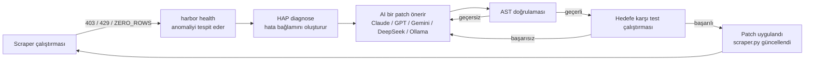
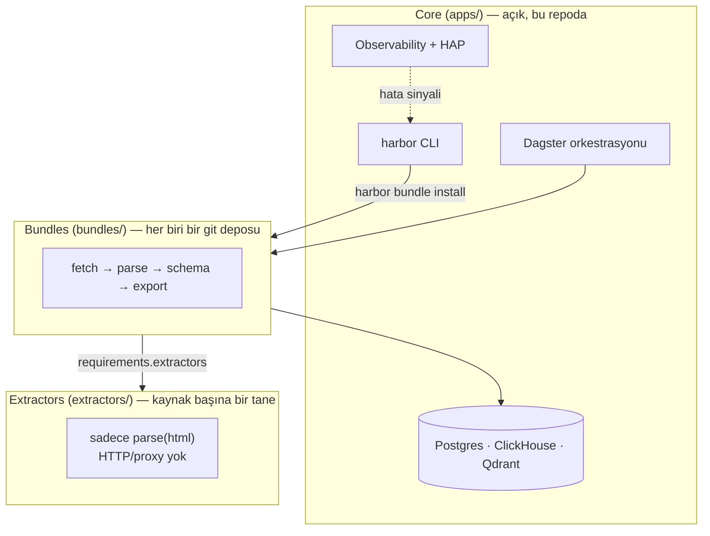

# 🌊 DataHarbor — kendi kendini onaran web scraper'lar

[](https://github.com/eugene-panin/DataHarbor/actions/workflows/ci.yml)
[](LICENSE)

> **Diller / Languages:** [🇬🇧 English](README.md) · [🇷🇺 Русский](README.ru.md) · [🇺🇦 Українська](README.uk.md) · [🇪🇸 Español](README.es.md) · **🇹🇷 Türkçe**

Her scraper er ya da geç bozulur: bir site markup'ını yeniden tasarlar, bir
selector eşleşmeyi bırakır ve pipeline sessizce sıfır satır döndürmeye
başlar. Genelde bunun anlamı, günler sonra bir insanın dashboard'daki
boşluğu fark edip parser'ı elle düzeltmesidir. **DataHarbor'daki
scraper'lar kendi hatalarını teşhis eder ve kendilerini yamalar** — bir AI
ajanı hata sinyalini okur, bir kod düzeltmesi önerir, bunu doğrular (AST +
hedefe karşı gerçek bir test çalıştırması) ve uygular. Diff'i diğer her
commit gibi siz gözden geçirirsiniz.

Bu döngü **Harbor Agent Protocol (HAP)**'dir ve bu projenin var oluş
nedeni budur. Geri kalan her şey — ClickHouse, Postgres, Qdrant, Dagster,
observability — kendi kendini onarmanın sadece bir demoda değil, gerçek
production'da çalışabilmesi için gereken, her şeyi hazır gelen
(batteries-included) platformdur.



## Bu proje neden var

- **Sadece uyarı vermek değil, kendi kendini onarmak.**
  `harbor health --auto-fix <bundle>` döngüyü uçtan uca kapatır: tespit →
  teşhis → yama → doğrulama → deploy. Modelden bağımsızdır (Claude, GPT,
  Gemini, DeepSeek veya yerel bir Ollama modeli) — kendi API anahtarınızı
  getirin, ya da hiç anahtar kullanmayın.
- **Her şeyi hazır gelen veri yığını.** PostgreSQL (`pgvector`), ClickHouse
  OLAP, Qdrant vektör arama, Dagster orkestrasyon ve Grafana observability
  birbirine bağlanmış halde tek bir `harbor up` ile çalışır; böylece
  pipeline'ınızın ilk günden itibaren verinin gerçekten inebileceği bir
  yeri olur.
- **Sadece insanlar için değil, AI coding ajanları için de tasarlandı.**
  [AGENTS.md](AGENTS.md), Claude Code, Codex, Gemini CLI ve Antigravity'nin
  hepsinin aynı şekilde okuduğu tek, ajandan bağımsız bir sözleşmedir
  (skill routing, mimari, doğrulama kuralları) — bkz.
  [§ AI ajanları ve HAP](#-ai-ajanları-ve-harbor-agent-protocol).

**Açık olan ile özel olan:** platform (`apps/`), CLI ve uçtan uca bir
`demo` bundle'ı open-core'dur ve bu repoda yaşar. Gerçek scraping
hedefleri — asıl bundle'lar ve siteye özgü extractor'lar — tasarım gereği
özeldir (aşağıdaki [Mimari](#-mimari-core--bundles--extractors) bölümüne
bakın) ve kendi git repolarınızdan `harbor bundle install` ile kurulur.
Bu repoyu klonlamak size çalışan bir platform ve çalışan bir örnek verir,
hazır scraper'lardan oluşan bir kütüphane değil.

---

## 🏛 Mimari: Core / Bundles / Extractors



* **Core (`apps/`)** — açık platform çalışma zamanı: PostgreSQL
  `pgvector`, ClickHouse OLAP, Qdrant, SeaweedFS S3, Dagster, Core bildirim
  sistemi (Telegram/Slack/webhooks). İsteğe bağlı: `uv sync --extra ml`,
  n8n için `--with-n8n`. Backup CLI, Core içinde kalır (`harbor backup`).
* **Bundles (`bundles/`)** — iş pipeline'ları (fetch → schema → Dagster →
  HTML/CSV export). Yayınlandığında bir bundle = bir git deposu.
* **Extractors (`extractors/`)** — tek bir kaynak için ayrıştırma
  eklentileri (yalnızca `parse(html, …)`; HTTP/proxy yok). Birden fazla
  bundle tarafından yeniden kullanılır. Open-core `demo_site` örneğini
  içerir; alana özel extractor'lar git'ten kurulur.

Bir bundle bağımlılıklarını `manifest.json` → `requirements.extractors`
içinde bildirir (yerel id, git URL veya `{name, source}`).
`harbor bundle install` sırasında platform, bildirilen extractor
kaynaklarını `extractors/` altına çeker.

---

## ⚡ Hızlı başlangıç

### 1. Kurulum
```bash
git clone https://github.com/eugene-panin/DataHarbor.git
cd DataHarbor
./install.sh   # uv gerektirir; bağımlılıkları `uv sync` ile kurar ve `harbor`'ı bağlar
```

```bash
uv sync
uv sync --extra ml   # isteğe bağlı: Whisper / EasyOCR / embeddings / HDBSCAN
uv run harbor --help
uv run harbor doctor   # Publish readiness dahil (git kimliği; gh isteğe bağlı)
```

### 2. Platformu başlatma
```bash
harbor up
```
*Platform servislerini Kubernetes (Tilt) veya Docker Compose
(`harbor up --compose`) ile başlatır.*

### 3. Durumu kontrol etme
```bash
harbor status
```

### 4. Demo bundle'ı deneyin (API anahtarı yok, dış ağ yok)

Open-core, çalışan uçtan uca bir örnek sunar: `demo` bundle'ı
(`bundles/demo/`) tarafından PostgreSQL'e scrape edilen statik bir
`demo_site` fixture'ı (`deploy/demo_site/`).

```bash
harbor bundle run demo    # yerel fixture'ı scrape eder, PostgreSQL'e yazar
harbor bundle view demo   # scrape edilen satırların HTML raporunu oluşturur
```

`harbor bundle run`, arka planda `dagster asset materialize`'ı çağırır;
aynısını Dagster UI'da elle de yapabilirsiniz (`demo` asset grubunu
materialize ederek). Bu bundle'ın dosyalarını (`fetch.py` / `scraper.py` /
`db.py` / `assets.py` / `exporter.py`) kendi bundle'ınız için başlangıç
noktası olarak kullanın.

### 5. Kendi kendini onarmasını izleyin

Demoyu bilerek bozun, sonra HAP'ın düzeltmesine izin verin:

```bash
# Drift'i simüle edin: demo_site extractor'ının aradığı selector'ı yeniden adlandırın
sed -i.bak 's/h1, h2, h3/h1, h3/' extractors/demo_site/extractor.py
harbor bundle run demo           # artık 0 satır döner — gerçek bir ZERO_ROWS anomalisi
harbor health                    # demo'yu DEGRADED olarak işaretler
harbor health --auto-fix demo    # AI teşhis eder, yamalar, AST ile doğrular, yeniden test eder
harbor bundle run demo           # satırlar geri geldi
```

(`.env` içinde bir LLM anahtarı gerekir — `AI_REPAIR_PROVIDER` /
`AI_REPAIR_API_KEY`, ya da yerel bir model için
`AI_REPAIR_PROVIDER=ollama`. Anahtar ayarlanmadı mı? `harbor health --fix
demo`, bunun yerine ajanın tam olarak neyle çalışacağını görebilmeniz için
diagnostic prompt'u yazdırır.)

---

## 📦 Publish: bundle'lar ve extractor'lar

Model: **1 eklenti = 1 git deposu**. Staging geçici bir dizin (veya
`--workdir`) kullanır; monorepo içinde iç içe `.git` oluşturulmaz.

```bash
# Yeni extractor / bundle
harbor extractor new demo_site
harbor bundle new my_leads --extractors demo_site

# Önce özel extractor'ı yayınlayın
harbor extractor publish demo_site --dry-run
harbor extractor publish demo_site
# → bundle manifest'ine: git@github.com:<you>/dh-extractor-demo-site.git

# Sonra bundle'ı yayınlayın
harbor bundle publish my_leads --dry-run
harbor bundle publish my_leads
# veya açıkça: --remote git@github.com:ORG/dh-bundle-my_leads.git
```

**Önemli:** `harbor bundle publish`, GitHub'da extractor depolarını
**kendiliğinden oluşturmaz**. `requirements.extractors` hâlâ yerel
id/path listeliyorsa (git URL değil), CLI bunları listeler ve
`harbor extractor publish <id>` önerir. Gerçek publish durur; `--dry-run`
yalnızca uyarır. Escape hatch: `--allow-local-extractors`. Gönderilen
`demo_site` örneği atlanır.

Bayraklar: `--remote`, `--workdir`, `--repo-name`,
`--visibility private|public`, `--public`, `--dry-run`. `git` ile birlikte
`user.name` / `user.email` gerekir; `gh` isteğe bağlıdır (özel GitHub
deposu otomatik oluşturma).

---

## 🌐 Yerel web servisleri ve portlar

| Servis | Açıklama | Yerel URL |
| :--- | :--- | :--- |
| ☸️ **Tilt** | Yerel Kubernetes kontrol paneli | [http://localhost:10350](http://localhost:10350) |
| ⚡ **Dagster UI** | ETL orkestratörü ve otomatik onarım panosu | [http://localhost:3000](http://localhost:3000) |
| 🚀 **ClickHouse** | Analitik için OLAP deposu | [http://localhost:8123](http://localhost:8123) |
| 🧭 **Qdrant** | Vektör arama / RAG | [http://localhost:6333/dashboard](http://localhost:6333/dashboard) |
| 📊 **Grafana** | Gözlemlenebilirlik panelleri | [http://localhost:3001](http://localhost:3001) |
| 🔄 **n8n** (isteğe bağlı) | No-code otomasyon merkezi | [http://localhost:56780](http://localhost:56780) (`harbor up --with-n8n`) |
| 🧪 **demo_site** | `demo` bundle'ı tarafından scrape edilen statik fixture | [http://localhost:8098](http://localhost:8098) |

---

## 🛠 CLI (`harbor`)

### 1. Ortam teşhisi ve kontrol
```bash
harbor doctor             # Docker, Tilt, Kind, Python, Git + Publish readiness
harbor health             # Scraper sağlığı, sıfır satır anomalileri, SLA
harbor health --auto-fix <bnd> # AST doğrulamalı AI onarıcı
harbor up                 # Kubernetes/Tilt (veya --compose)
harbor down
harbor status
harbor uninstall          # ~/DataHarbor_Backups'a otomatik yedekle kaldırma
```

### 2. Ana yedekleme ve geri yükleme
```bash
harbor backup create
harbor backup restore <file.tar.gz>
harbor backup list
```

### 3. Harbor Agent Protocol (HAP v1.0)
```bash
harbor agent-protocol status
harbor agent-protocol diagnose <bnd>
harbor agent-protocol patch <bnd> --code-file <file>
harbor agent-protocol test <bnd>
```

### 4. Bundles
```bash
harbor bundle list
harbor bundle new <name> [--template default|ml|etl|dagster]
harbor bundle templates
harbor bundle install <src>   # Git / arşiv / klasör; bildirilen extractors'ı çeker
harbor bundle resolve <name>  # Manifest'ten eksik extractors'ı kur
harbor bundle pack <name>
harbor bundle publish <name> [--dry-run] [--remote URL] [--allow-local-extractors]
harbor bundle remove <name>
harbor bundle run <name>      # tüm Dagster asset'lerini senkron olarak materialize eder (UI gerekmez)
harbor bundle export / view
harbor bundle validate
harbor bundle doctor [name]   # motorlar, python bağımlılıkları, extractors, Dagster tanımları
harbor workspace refresh      # çoklu code-location workspace.yaml'ı yeniden üretir
harbor workspace show
```

### 5. Extractors
```bash
harbor extractor list
harbor extractor new <name> [--path DIR]
harbor extractor install <src>
harbor extractor pack <name>
harbor extractor publish <name> [--dry-run] [--remote URL]
harbor extractor resolve <bundle>
harbor extractor validate [name]
harbor extractor remove <name>
```

---

## 🤖 AI ajanları ve Harbor Agent Protocol

[AGENTS.md](AGENTS.md), bu repo için tek, ajandan bağımsız sözleşmedir —
mimari, bundle/extractor manifest şeması ve HAP v1.0'ın
diagnose → patch → validate → test akışı. `CLAUDE.md` ve `GEMINI.md` buna
işaret eden ince yönlendiricilerdir; böylece **Claude Code**, **Codex**,
**Gemini CLI** ve **Antigravity** birbirinden sapmak yerine aynı tek
doğruluk kaynağını okur.

Tek bir her-şeyi-yapan prompt yerine, işi niyete göre yönlendiren üç
kapsamlı skill vardır:

| Skill | Görev |
| :--- | :--- |
| [`dataharbor-bundle-designer`](.agents/skills/dataharbor-bundle-designer/SKILL.md) | Yeni bir bundle/extractor yazın veya iskeletini oluşturun |
| [`dataharbor-bundle-operator`](.agents/skills/dataharbor-bundle-operator/SKILL.md) | health/SLA kontrolü yapın, `harbor agent-protocol summary` çalıştırın |
| [`dataharbor-remediator`](.agents/skills/dataharbor-remediator/SKILL.md) | Bozuk bir scraper'ı teşhis edin ve onarın (HAP) |

`harbor skill install`, bunları `~/.claude/skills` içine kopyalar
(Codex/Gemini/Antigravity için de eşdeğer yola) böylece bu araçlardan
herhangi biri onları otomatik olarak alır.

---

## 🤝 Katkıda Bulunma

Open-core platforma katkılar memnuniyetle karşılanır — dev kurulumu,
CI'ın çalıştırdığı test/lint kapıları ve PR yönergeleri için
**[CONTRIBUTING.md](CONTRIBUTING.md)** dosyasına bakın. Lütfen
**[Code of Conduct](CODE_OF_CONDUCT.md)**'u da okuyun.

Bir güvenlik açığı mı buldunuz? Lütfen bunu özel olarak bildirin —
herkese açık bir issue açmak yerine **[SECURITY.md](SECURITY.md)**'e
bakın.

---

## 📄 Lisans

MIT License © DataHarbor Core Team
