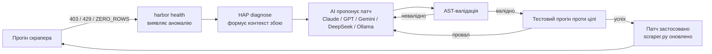
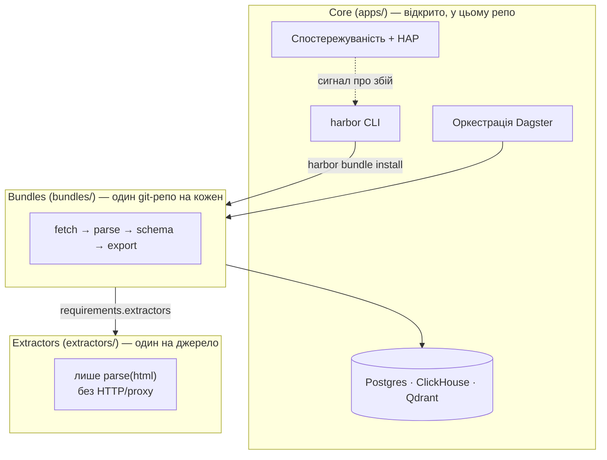

# 🌊 DataHarbor — веб-скрапери, що лагодять самі себе

[](https://github.com/eugene-panin/DataHarbor/actions/workflows/ci.yml)
[](LICENSE)

> **Languages:** [🇬🇧 English](README.md) · [🇷🇺 Русский](README.ru.md) · **🇺🇦 Українська** · [🇪🇸 Español](README.es.md) · [🇹🇷 Türkçe](README.tr.md)

> **21.09.2026:** зовнішній аудит після першого публічного релізу знайшов
> 22 проблеми плюс 4 додаткових спостереження — у self-healing, шарі
> даних, CLI/Kubernetes-деплої та безпеці (path traversal, publish, що йде
> за симлінками, крок бекапу, який міг збрехати про успіх). Усе виправлено
> й перевірено — частину знахідок живою перевіркою на реально запущеному
> стеку або одноразовому `kind`-кластері, а не лише читанням коду. Повний
> список із причинами і перевіркою: **[CHANGELOG.md](CHANGELOG.md)**.

Рано чи пізно ламається будь-який скрапер: сайт змінює розмітку, селектор
перестає спрацьовувати, і пайплайн тихо починає повертати нуль рядків.
Зазвичай це помічає людина — через кілька днів, дивлячись на дашборд — а
потім вручну править парсер. **Скрапери DataHarbor самі діагностують свої
збої і самі себе лагодять**: AI-агент читає сигнал про збій, пропонує
виправлення коду, перевіряє його (AST + реальний тестовий прогін проти
цільового сайту) і застосовує. Ви переглядаєте диф так само, як будь-який
інший коміт.

Цей цикл і є **Harbor Agent Protocol (HAP)** — заради нього цей проєкт і
існує. Усе інше — ClickHouse, Postgres, Qdrant, Dagster, спостережуваність —
це платформа «з батарейками в комплекті», яка потрібна самовідновленню, щоб
реально працювати в проді, а не лише в демці.



## Навіщо це існує

- **Самовідновлення, а не просто алерти.** `harbor health --auto-fix <bundle>`
  замикає цикл повністю: виявити → діагностувати → пропатчити → перевірити →
  задеплоїти. Model-agnostic (Claude, GPT, Gemini, DeepSeek або локальна
  модель Ollama) — свій ключ, або взагалі без ключа.
- **Дата-стек «з батарейками».** PostgreSQL (`pgvector`), ClickHouse OLAP,
  векторний пошук Qdrant, оркестрація Dagster і спостережуваність Grafana —
  зв'язані разом і піднімаються одним `harbor up`, тож пайплайну з першого
  дня є куди по-справжньому класти дані.
- **Зроблено для AI coding-агентів, а не лише для людей.** [AGENTS.md](AGENTS.md) —
  єдиний agent-agnostic контракт (маршрутизація skill'ів, архітектура,
  правила верифікації), який однаково читають **Claude Code**, **Codex**,
  **Gemini CLI** та **Antigravity** — див.
  [§ AI-агенти та HAP](#-ai-агенти-та-harbor-agent-protocol).

**Що відкрито, а що приватне:** платформа (`apps/`), CLI і один наскрізний
демо-бандл `demo` — open-core і лежать у цьому репозиторії. Реальні цілі для
скрапінгу — конкретні бандли та екстрактори під сайти — приватні за задумом
(див. [Архітектуру](#-архітектура-core--bundles--extractors) нижче) і
встановлюються з ваших власних git-репозиторіїв через `harbor bundle
install`. Клонування цього репо дає робочу платформу й робочий приклад, а не
бібліотеку готових скраперів.

---

## 🏛 Архітектура: Core / Bundles / Extractors



* **Core (`apps/`)** — відкрите ядро платформи: PostgreSQL `pgvector`,
  ClickHouse OLAP, Qdrant, SeaweedFS S3, Dagster, Core-нотифікатор
  (Telegram/Slack/webhooks). Опційно: `uv sync --extra ml`, n8n через
  `--with-n8n`. CLI для бекапів лишається в Core (`harbor backup`).
* **Bundles (`bundles/`)** — бізнес-пайплайни (fetch → schema → Dagster →
  HTML/CSV export). Один бандл = один git-репозиторій після публікації.
* **Extractors (`extractors/`)** — плагіни парсингу одного джерела (лише
  `parse(html, …)`; без HTTP/proxy). Перевикористовуються кількома бандлами.
  Open-core постачає приклад `demo_site`; доменні екстрактори встановлюються
  з git.

Бандл оголошує залежності в `manifest.json` → `requirements.extractors`
(локальний id, git URL або `{name, source}`). Під час `harbor bundle
install` платформа підтягує оголошені джерела екстракторів у `extractors/`.

---

## ⚡ Швидкий старт

### 1. Встановлення
```bash
git clone https://github.com/eugene-panin/DataHarbor.git
cd DataHarbor
./install.sh   # потребує uv; ставить залежності через `uv sync` і лінкує `harbor`
```

```bash
uv sync
uv sync --extra ml   # опційно: Whisper / EasyOCR / embeddings / HDBSCAN
uv run harbor --help
uv run harbor doctor   # зокрема Publish readiness (git identity; gh опційно)
```

### 2. Запуск платформи
```bash
harbor up
```
*Піднімає сервіси платформи в Kubernetes (Tilt) або Docker Compose (`harbor up --compose`).*

### 3. Перевірка статусу
```bash
harbor status
```

### 4. Спробувати демо-бандл (без API-ключів, без зовнішньої мережі)

Open-core постачає робочий наскрізний приклад: статична фікстура
`demo_site` (`deploy/demo_site/`), яку бандл `demo` (`bundles/demo/`)
скрапить у PostgreSQL.

```bash
harbor bundle run demo    # скрапить локальну фікстуру, пише в PostgreSQL
harbor bundle view demo   # рендерить HTML-звіт зі скрапнутих рядків
```

`harbor bundle run` під капотом викликає `dagster asset materialize`; те
саме можна зробити вручну в Dagster UI (матеріалізувати групу асетів
`demo`). Використовуйте файли цього бандла (`fetch.py` / `scraper.py` /
`db.py` / `assets.py` / `exporter.py`) як стартову точку для свого.

### 5. Подивитися, як він лагодить себе сам

Навмисно зламайте демку, а потім дайте HAP її полагодити:

```bash
# Симулюємо дрейф: перейменовуємо селектор, який шукає екстрактор demo_site
sed -i.bak 's/h1, h2, h3/h1, h3/' extractors/demo_site/extractor.py
harbor bundle run demo                               # тепер повертає 0 рядків — справжня аномалія ZERO_ROWS
harbor health                                         # позначає demo як DEGRADED
harbor health --auto-fix demo --url http://demo_site/   # діагностика, патч, AST-валідація, жива перевірка
harbor bundle run demo                                # рядки повернулися
```

`--url` справді замикає цикл: після AST-валідації патч застосовується і
**перевіряється живим скрапінгом за цією URL**. Якщо рядків усе ще нуль,
помилка повертається моделі для однієї повторної спроби; якщо й це не
допомагає, `scraper.py` відкочується до версії до патчу, а не залишається
у стані "виглядає пропатченим, але не працює". Без `--url` патч проходить
лише перевірку імпорту — цього достатньо, щоб зловити биту посилання в
коді, але не достатньо, щоб довести, що скрапінг справді працює.

Потрібен LLM-ключ у `.env` — `AI_REPAIR_PROVIDER` / `AI_REPAIR_API_KEY`,
або `AI_REPAIR_PROVIDER=ollama` для локальної моделі. Немає ключа? `harbor
health --fix demo` замість цього виведе діагностичний промпт, щоб ви
побачили, з чого саме виходив би агент.

---

## 📦 Publish: бандли та екстрактори

Модель: **1 плагін = 1 git-репо**. Staging у тимчасову теку (або
`--workdir`); вкладений `.git` усередині monorepo ніколи не створюється.

```bash
# Новий extractor / bundle
harbor extractor new demo_site
harbor bundle new my_leads --extractors demo_site

# Спочатку публікуємо кастомний extractor
harbor extractor publish demo_site --dry-run
harbor extractor publish demo_site
# → прописати в manifest бандла: git@github.com:<you>/dh-extractor-demo-site.git

# Потім публікуємо бандл
harbor bundle publish my_leads --dry-run
harbor bundle publish my_leads
# або явно: --remote git@github.com:ORG/dh-bundle-my_leads.git
```

**Важливо:** `harbor bundle publish` **не** створює репозиторії екстракторів
на GitHub автоматично. Якщо в `requirements.extractors` досі лишилися
локальні id/шляхи (не git URL), CLI покаже їх список і запропонує `harbor
extractor publish <id>`. Реальний publish на цьому зупиниться; `--dry-run`
лише попереджає. Запасний варіант: `--allow-local-extractors`. Вбудований
приклад `demo_site` пропускається.

Прапорці: `--remote`, `--workdir`, `--repo-name`, `--visibility
private|public`, `--public`, `--dry-run`. Потрібні `git` плюс `user.name` /
`user.email`; `gh` опційний (автостворення приватного репо на GitHub).

---

## 🌐 Локальні веб-сервіси та порти

| Сервіс | Опис | Локальний URL |
| :--- | :--- | :--- |
| ☸️ **Tilt** | Панель керування локальним Kubernetes | [http://localhost:10350](http://localhost:10350) |
| ⚡ **Dagster UI** | Оркестратор ETL і дашборд авторемонту | [http://localhost:3000](http://localhost:3000) |
| 🚀 **ClickHouse** | OLAP-сховище для аналітики | [http://localhost:8123](http://localhost:8123) |
| 🧭 **Qdrant** | Векторний пошук / RAG | [http://localhost:6333/dashboard](http://localhost:6333/dashboard) |
| 📊 **Grafana** | Дашборди спостережуваності | [http://localhost:3001](http://localhost:3001) |
| 🔄 **n8n** (опційно) | No-code хаб автоматизації | [http://localhost:56780](http://localhost:56780) (`harbor up --with-n8n`) |
| 🧪 **demo_site** | Статична фікстура, яку скрапить бандл `demo` | [http://localhost:8098](http://localhost:8098) |

---

## 🛠 CLI (`harbor`)

### 1. Діагностика та керування оточенням
```bash
harbor doctor             # Docker, Tilt, Kind, Python, Git + Publish readiness
harbor health             # Здоров'я скраперів, аномалії нульових рядків, SLA
harbor health --auto-fix <bnd> --url <url> # AI-ремедіатор: AST-валідація + жива перевірка + відкат при невдачі
harbor up                 # Kubernetes/Tilt (або --compose)
harbor down
harbor status
harbor uninstall          # Видалення з авто-бекапом у ~/DataHarbor_Backups
```

### 2. Майстер-бекап і відновлення
```bash
harbor backup create
harbor backup restore <file.tar.gz>
harbor backup list
```

### 3. Harbor Agent Protocol (HAP v1.0)
```bash
harbor agent-protocol status
harbor agent-protocol diagnose <bnd>
harbor agent-protocol patch <bnd> --code-file <file>
harbor agent-protocol test <bnd>
```

### 4. Бандли
```bash
harbor bundle list
harbor bundle new <name> [--template default|ml|etl|dagster]
harbor bundle templates
harbor bundle install <src>   # Git / архів / тека; підтягує оголошені extractors
harbor bundle resolve <name>  # Довстановити відсутні extractors з manifest
harbor bundle pack <name>
harbor bundle publish <name> [--dry-run] [--remote URL] [--allow-local-extractors]
harbor bundle remove <name>
harbor bundle run <name>      # синхронно матеріалізувати всі асети Dagster (без UI)
harbor bundle export / view
harbor bundle validate
harbor bundle doctor [name]   # рушії, python-залежності, extractors, Dagster defs
harbor workspace refresh      # перегенерувати мультилокаційний workspace.yaml
harbor workspace show
```

### 5. Extractors
```bash
harbor extractor list
harbor extractor new <name> [--path DIR]
harbor extractor install <src>
harbor extractor pack <name>
harbor extractor publish <name> [--dry-run] [--remote URL]
harbor extractor resolve <bundle>
harbor extractor validate [name]
harbor extractor remove <name>
```

---

## 🤖 AI-агенти та Harbor Agent Protocol

[AGENTS.md](AGENTS.md) — єдиний agent-agnostic контракт для цього
репозиторію: архітектура, схема манифесту bundle/extractor і потік HAP
v1.0 diagnose → patch → validate → test. `CLAUDE.md` і `GEMINI.md` —
тонкі вказівники на нього, тож **Claude Code**, **Codex**, **Gemini CLI**
і **Antigravity** читають одне й те саме джерело істини замість того, щоб
розходитися.

Три вузькоспеціалізовані skill'и маршрутизують роботу за наміром замість
одного промпта-на-все:

| Skill | Задача |
| :--- | :--- |
| [`dataharbor-bundle-designer`](.agents/skills/dataharbor-bundle-designer/SKILL.md) | Написати або згенерувати новий bundle/extractor |
| [`dataharbor-bundle-operator`](.agents/skills/dataharbor-bundle-operator/SKILL.md) | Перевірити health/SLA, запустити `harbor agent-protocol summary` |
| [`dataharbor-remediator`](.agents/skills/dataharbor-remediator/SKILL.md) | Діагностувати й полагодити зламаний скрапер (HAP) |

`harbor skill install` копіює їх у `~/.claude/skills` (і відповідний шлях
для Codex/Gemini/Antigravity), тож будь-який з цих інструментів підхоплює
їх автоматично.

---

## 🤝 Contributing

Внески у відкриту частину платформи вітаються — див.
**[CONTRIBUTING.md](CONTRIBUTING.md)** щодо налаштування середовища
розробки, гейтів тестів/лінту, які запускає CI, та правил оформлення PR.
Також прочитайте **[Кодекс поведінки](CODE_OF_CONDUCT.md)**.

Знайшли проблему з безпекою? Повідомте про неї приватно — див.
**[SECURITY.md](SECURITY.md)**, не відкривайте публічний issue.

---

## 📄 License

MIT License © DataHarbor Core Team
